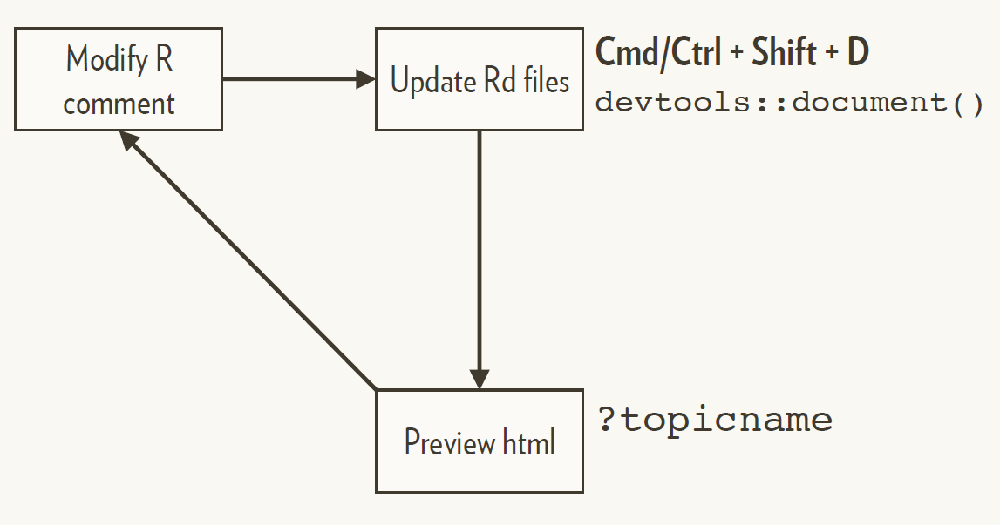

```{r setup, include=FALSE}
options(digits = 4)
options(width = 67)
library(fs)
library(knitr)
library(kableExtra)
opts_chunk$set(echo = TRUE, dev = "png", dpi = 300,
               comment = "#", eval = TRUE,
               fig.width = 5, fig.height = 5,
               knitr.table.format = "markdown")
# trim white space top and right of plot
knit_hooks$set(small.mar = function(before, options, envir) {
    if (before) par(mar = c(4, 5, 2, 1))
})
# trim white space when par won't work
library(magick)
knit_hooks$set(crop = function(before, options, envir) {
    if (before || isTRUE((fig.num <- options$fig.num) == 0L))
        return()
    paths = fig_path(options$fig.ext, options, fig.num)
    for (f in paths) image_write(image_trim(image_read(f)), f)
})
# function to put ``` when compiling Rmd
ticks <- function() "```"
set.seed(1)
```

# Functions: Documentation and the NAMESPACE

- Documenting functions with roxygen2
- NAMESPACE: exporting functions
- NAMESPACE: importing functions

---

class: inverse middle
# Function documentation with roxygen2

---

## roxygen2

The `roxygen2` package generates documentation from specially formatted comments, that we write above the function code, e.g.

```{r, eval = FALSE}
#' @param x A numeric vector.
```


`#'` is a Roxygen comment.

`@param` is a Roxygen tag.

The `@param` tag takes an argument: the name of the parameter

The remaining text (until the next tag in the file) is the documentation
relevant to the tag.

---

## Common tags

There are four tags you’ll use for most functions

Tag        | Purpose
---------- | -------------
@param arg | Describe inputs
@examples  | Show how the function works
@return    | Describe the return value (not needed if `NULL`)
@export    | Add this tag if the function should be user-visible

Usual RStudio shortcuts work in the @examples section, allowing you to run code interactively.

???

Other important ones:
@seealso   | Pointers to related functions
@references
@importFRom
@method
@note
@rdname
@keywords internal
@format (data)
@section

---

## The description block

The roxygen comment should start with a description block.
- First sentence is the **title**.
- Next paragraph is the **description**.
- Everything else is the **details** (optional).

```

#' Title in Title Case of up to 65 Characters
#'
#' Mandatory description of what the function does. Should be a short paragraph
#' of a few lines only.
#'
#' The details section is optional and may be several paragraphs. It can even
#' contain sub-sections (not illustrated here).
```

---

## RStudio helps you get started

Put your cursor inside a function, then select Insert Roxygen Skeleton from
the Code menu

.pull-left[
```{r, out.width = "500px", echo=FALSE}
knitr::include_graphics("insert_roxygen_skeleton.png")
```
]

.pull-right[
```{r, eval = FALSE}
#' Title
#'
#' @param animal
#' @param sound
#'
#' @return
#' @export
#'
#' @examples
animal_sounds <- function(animal, sound) {
  stopifnot(is.character(animal) & length(animal) == 1)
  stopifnot(is.character(sound) & length(sound) == 1)
  message("The ", animal, " goes ", sound, "!")
}
```
]

---

## Example roxygen documentation

```r
#' Sort a Numeric Vector in Decreasing Order
#'
#' Sort a numeric vector so that the values are in deceasing order.  Missing
#' values are optionally removed or put last.
#'
#' @param x A numeric vector.
#' @param na.rm A logical value indicating whether to remove missing values
#' before sorting.
#' @return A vector with the values sorted in descreasing order.
#' @export
#'
#' @examples
#' x <- c(3, 7, 2, NA)
#' high_to_low(x)
#' high_to_low(x, na.rm = TRUE)
```

---

class: clear font160

## R documentation file

roxygen2 converts the roxygen block to an `.Rd` file in the `/man` directory

```
% Generated by roxygen2: do not edit by hand
% Please edit documentation in R/high_to_low.R
\name{high_to_low}
\alias{high_to_low}
\title{Sort a Numeric Vector in Decreasing Order}
\usage{
high_to_low(x, na.rm = FALSE)
}
\arguments{
\item{x}{A numeric vector.}
\item{na.rm}{A logical value indicating whether to remove missing values
before sorting.}
}
\value{
...
```

---

## HTML file

When the package is installed, the `.Rd` is converted by R to HTML on demand

.center[
```{r, out.width = "500px", echo=FALSE}

```
]
---

## Regular documentation workflow

.center[
```{r, out.width = "800px", echo=FALSE}

```
]
--
.center[
You must have loaded the package with
`load_all()` at least once.
]

---

class: inverse center middle

# Namespace: exports

---

## A namespace splits functions into two classes

<br>

Internal                    | External
--------------------------- | -------------
Only for use within package | For use by others
Documentation optional      | Must be documented
Easily changed              | Changing will break other people’s code

---

## The default NAMESPACE exports everything

```
# Generated by roxygen2: fake comment so
# roxygen2 overwrites silently.
exportPattern("^[^\\.]")
```

---

## Better to export functions explicitly

```r
#' @export
fun1 <- function(...) {}
```

When we call `devtools::document()`, an `export()` directive will be added to
NAMESPACE for each function that has an `#' @export` comment.

```
# Generated by roxygen2: do not edit by hand

export(fun1)
```

---

## Export functions that people should use

Don't export internal helpers

```r
# Defaults for NULL values
`%||%` <- function(a, b) if (is.null(a)) b else a

# Remove NULLs from a list
compact <- function(x) {
  x[!vapply(x, is.null, logical(1))]
}
```

---

# Your turn

For the `animal_sounds` function:

1. Insert a Roxygen skeleton using the RStudio helper.
2. Create a draft documentation file with `devtools::document()` or
`Cmd/Ctrl + Shift + D`.
3. Click on "Diff" in the Git pane and view the changes that have been made.
4. Preview the HTML help with `?animal_sounds`.
5. Fill in the Roxygen skeleton for `animal_sounds()`, recreating the documentation
file and previewing the HTML help to view your updates.
5. When you have finished editing, run `devtools::document()` to ensure the
`.Rd` file is in sync. Make a git commit with your updated `R/animal_sounds.R`
file, the updated NAMESPACE, and the new `man/animal_sounds.Rd` file.

---

## .Rd Markup

`.Rd` files recognise LaTeX-like mark-up in most text-based fields, e.g.

```
#' This is a convenience function that is a wrapper around
#' \code{\link{sort.int}}.
```

Details can be found in the [Writing R documentation files](https://cran.r-project.org/doc/manuals/r-release/R-exts.html#Writing-R-documentation-files)
section of the Writing R Extensions manual.

---

## Using markdown

Most commonly-used mark-up is easier with markdown (can be mixed with .Rd mark-up).

Text formatting: `**bold**`, `_italic_`, ` `code` `

Create links

* To a function in the same package: `[func()]`
* To a function in a different package: `[pkg::func()]`

With different link text, e.g. `[link text][func()]`

For more details, see the [(R)Markdown support](https://cran.r-project.org/web/packages/roxygen2/vignettes/rd-formatting.html) vignette.

---

## View documentation with links

To view the documentation with working links, we must install the package first.

.center[
```{r, out.width = "700px", echo=FALSE}

```
]

???

---

# Your turn

1. Add some details to the help package for `animalSounds()`, with a link to
`paste0()`.
2. Verify that no link is shown when recreating the documentation with the
regular workflow.
3. Create the documentation with the second workflow and look at the help file.
Does the link to `paste0()` work?
4. Commit all your changes to the git repo.

---

class: inverse center middle

# Dependencies

---

# Dependencies

Dependencies are other R packages that our package uses. There are three
types of dependency:

**Imports**: required packages, will be installed when our package is installed
if they are not already installed.

**Suggests**: optional packages, e.g. only used for development; only used in
documentation. *Not* installed automatically with our package.

**Depends**: essentially deprecated for packages, may be used to specify a
minimum required version of R (i.e., version of the core packages).

---

## Imported packages

In DESCRIPTION
<pre>
Imports: pkgname
</pre>

Use `::` to access functions
```r
new_function <- function(x, y, z) {
  pkgname::imported_function(x, y) + z
}
```

---

## Suggested packages

In DESCRIPTION
<pre>
Suggests: pkgname
</pre>

In package functions or examples, handle the case where **pkgname** is not available
```r
if (!requireNamespace("pkgname", quietly = TRUE)){
  warning("pkgname must be installed to perform this function",
          "returning NULL")
  return(NULL)
}
```

???
Also explain conditional use in vignettes later

---

## `use_package()`

`use_package()` will modify the DESCRIPTION and remind you how to use the
function.

By default, packages will be added to "Imports".

```r
usethis::use_package("assertthat")
usethis::use_package("glue", type = "Suggests")
```

---

class: inverse center middle

# Namespace: imports

---

## You might get tired of using :: all the time

Or you might want to use an infix function
```r
`%>%` <- magittr::`%>%`

col_summary <- function(df, fun) {
  stopifnot(is.data.frame(df))

  df %>%
    purrr::keep(is.numeric) %>%
    purrr::modify(fun)
}

```

---

## You can **import** functions into the package

```r
#' @importFrom purrr keep modify
#' @importFrom magrittr %>%
col_summary <- function(df, fun) {
  stopifnot(is.data.frame(df))

  df %>%
    keep(is.numeric) %>%
    modify(fun)
}
```

`devtools::document()` will add corresponding `import()` statements to the
NAMESPACE, e.g. `import(purr, keep, modify)`.

Adding formal imports is slightly more efficient than using `::`.

---

## Package-level import file

Imports belong to the package, not to individual functions, so you might want
to recognise this by storing them in a central location, e.g. `R/imports.R`

```r
#' @importFrom purrr keep map
#' @importFrom magrittr %>%
NULL
```

---

##  Importing everything from a package seems easy

```r
#' @import purrr
col_summary <- function(df, fun) {
  stopifnot(is.data.frame(df))

  df %>%
    keep(is.numeric) %>%
    map_dfc(fun)
}

```

---

## But is dangerous...

```r
#' @import pkg1
#' @import pkg2
fun <- function(x) {
  fun1(x) + fun2(x)
}

```

Works today...

... But next year, **pkg2** adds a `fun1` function


---

# Documenting dependencies

<br>

Description                 | NAMESPACE
--------------------------- | -------------
Makes **package** available | Makes function available
Mandatory                   | Optional (can use :: instead)
`use_package()`             | `#' @importFrom`

???

plus example of adding import?

---

# Example: assertthat

Currently we are using `stopifnot()` for argument validation

```{r, eval = FALSE}
stopifnot(is.character(animal) & length(animal) == 1)
stopifnot(is.character(sound) & length(sound) == 1)
```

We might instead use `assertthat::assert_that()`

```{r, eval = FALSE}
library(assertthat)
assert_that(is.string(animal),
            is.string(sound))
```

---

# Your Turn

1. Use `use_package()` to add `assertthat` to `Imports`.
2. Update `animal_sounds()` to use `assert_that()` to validate the arguments, using `::` to fully qualify the function calls.
3. Load all and try giving `animal_sounds()` invalid inputs for animal and/or sound.
4. Commit your changes to git.
5. Push your commits for this session.
  
---

# References

Wickham, H and Bryan, J, _R Packages_ (2nd edn, in progress), https://r-pkgs.org.

R Core Team, _Writing R Extensions_, https://cran.r-project.org/doc/manuals/r-release/R-exts.html

---

## License

<a rel="license" href="http://creativecommons.org/licenses/by-nc-sa/4.0/"></a><br /><span xmlns:dct="http://purl.org/dc/terms/" property="dct:title">Package Development Workshop</span> by <a href="https://github.com/hturner">Heather Turner</a> is licensed under <a rel="license" href="http://creativecommons.org/licenses/by-nc-sa/4.0/">CC BY-NC-SA 4.0</a>. Derivative of <a href="https://github.com/forwards/workshops">Package Development Workshop</a> by <a href="https://forwards.github.io/about/">Forwards</a>, used under <a rel="license" href="http://creativecommons.org/licenses/by-nc-sa/4.0/">CC BY-NC-SA 4.0</a>. 
