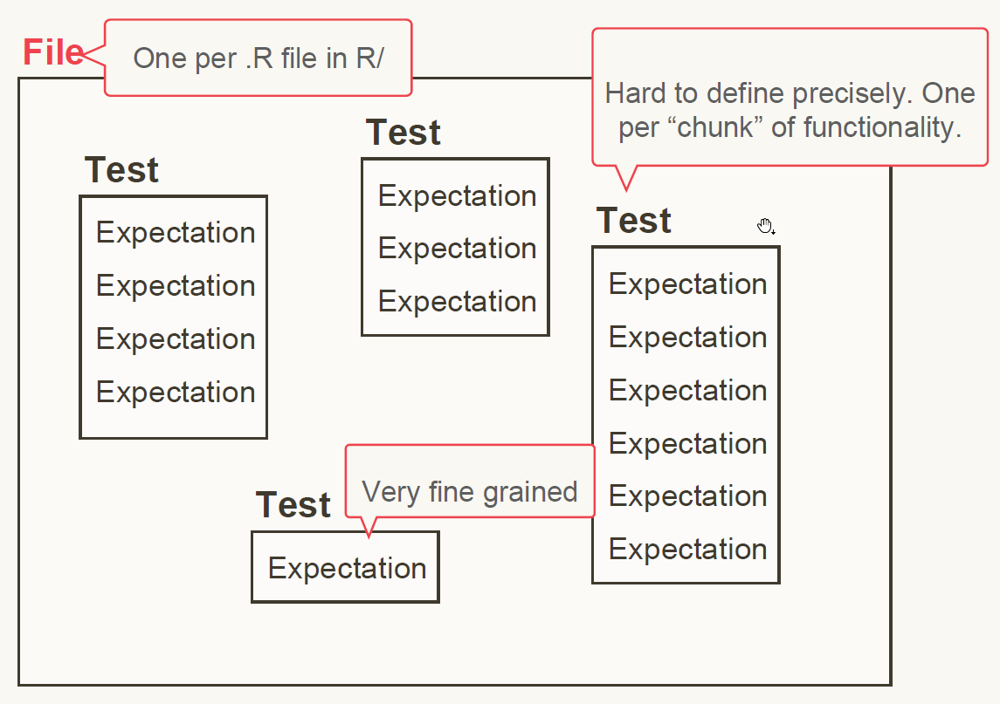
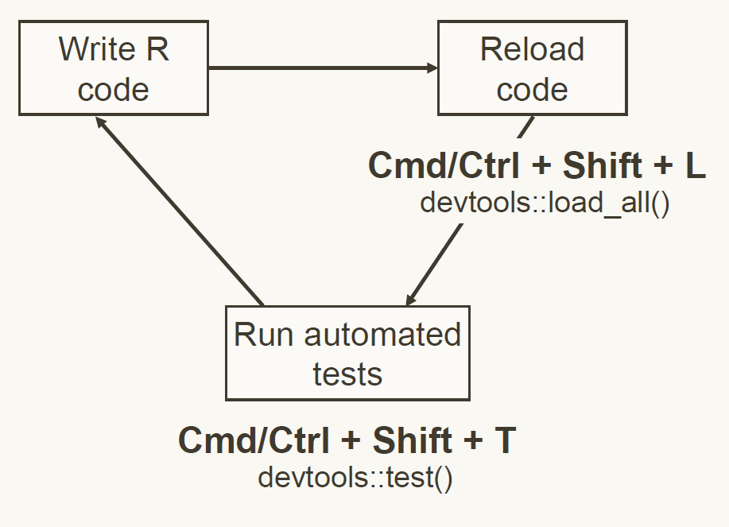

```{r setup, include=FALSE}
options(digits = 4)
options(width = 67)
library(fs)
library(knitr)
library(kableExtra)
opts_chunk$set(echo = TRUE, dev = "png", dpi = 300,
               comment = "#", eval = TRUE, 
               fig.width = 5, fig.height = 5, 
               knitr.table.format = "markdown")
# trim white space top and right of plot
knit_hooks$set(small.mar = function(before, options, envir) {
    if (before) par(mar = c(4, 5, 2, 1))
})
# trim white space when par won't work
library(magick)
knit_hooks$set(crop = function(before, options, envir) {
    if (before || isTRUE((fig.num <- options$fig.num) == 0L))
        return()
    paths = fig_path(options$fig.ext, options, fig.num)
    for (f in paths) image_write(image_trim(image_read(f)), f)
})
# function to put ``` when compiling Rmd
ticks <- function() "```"
set.seed(1)
```

class: inverse middle

# Data

---

# Including data

There are 3 types of data we might want to include:

- Exported data for the user to access: put in `/data`
- Internal data for functions to access: put in `/R/sysdata.rda`
- Raw data: put in `/inst/extdata`

---

# Exported data

The data should be saved in `/data` as an `.rda` (or `.RData`) file using 
`save()`.

`usethis::use_data()` will do this for you:

```{r, eval = FALSE}
letter_indices <- data.frame(letter = letters, index = seq_along(letters))
usethis::use_data(letter_indices)
```

For larger datasets, you can try changing the `compress` argument to get the 
best compression.

---

## Provenance

Often the data that you want to make accessible to the users is one you have created with an R script - either from scratch or from a raw data set.

It's a good idea to put the R script and any corresponding raw data in `/data-raw`.

`usethis::use_data_raw("dataname")` will set this up
 - Create `/data-raw`
 - Add `/data-raw/dataname.R` for you to add the code needed to create the data
 - Add `^data-raw$` to `.Rbuildignore` as it does not need to be included in the actual package.

You should add any raw data files (e.g. `.csv` files) to `/data-raw`.

---

# Documenting Data

Datasets in `/data` are always exported, so must be documented.

To document a dataset, we must have an `.R` script in `/R` that contains a Roxygen block above the name of the dataset.

As with functions, you can choose how to arrrange this, e.g. in one combined `/R/data.R` or in a separate R file for each dataset.

---

# Example: letter_indices

```
#' Letters of the Roman Alphabet with Indices
#'
#' A dataset of lower-case letters of the Roman alphabet and their 
#' numeric index from a = 1 to z = 26.
#'
#' @format A data frame with 26 rows and 2 variables:
#' \describe{
#'   \item{letter}{The letter as a character string.}
#'   \item{index}{The corresponding numeric index.}
#' }
"letter_indices"
```

`#' @ examples` can be used here too.

---

# Data Source

For collected data, the (original) source should be documented with `#' @source`.

This should either be a url, e.g.
```{r}
#' @source \url{http://www.diamondse.info/}
```
(alternatively `\href{DiamondSearchEngine}{http://www.diamondse.info/}`), 
or a reference, e.g.
```{r, eval = FALSE}
#' @source Henderson and Velleman (1981), Building multiple  
#' #' regression models interactively. *Biometrics*, **37**, 391–411.
```

---

# Internal data

Sometimes functions need access to reference data, e.g. constants or lookup tables, that dont' need to be shared with users.

These objects should be save in a single `R/sysdata.rda` file.

This can be done with `use_data(..., internal = TRUE)`, e.g.

```{r, eval = FALSE}
x <- sample(1000)
usethis::use_data(x, mtcars, internal = TRUE)
```

The generating code and any raw data can be put in `/data-raw`.

As the objects are not exported, they don't need to be documented.

---

# Raw data

Sometimes you want to include raw data, to use in examples or vignettes.

These files can be any format and should be added directly into `/inst/extdata`.

When the package is installed, these files will be copied to the `extdata` directory and can be accessed as follows:

```{r, eval = FALSE}
system.file("extdata", "mtcars.csv", package = "readr")
```

---

# Your Turn

1. Run `usethis::use_data_raw("farm_animals")`.
2. In the script `R/farm_animals.R` write some code to create a small data frame with the names of farm animals and the sound they make.
3. At the end of the script, add `usethis::use_data("farm_animals")`. Run all the code to create the data and save it in `/data`.
4. Add an `R/farm_animals.R` script and add some roxygen comments to document the function.
5. Run `devtools::document()` to create the documentation for the `farm_animals` data. Preview the documentation to check it.
6. Commit all the changes to your repo.


---


class: inverse center middle

# Unit testing

---

## Why test?

We build new functions one bit at a time.

What if a new thing we add changes the existing functionality?

How can we check and be sure all the old functionality still works with New Fancy Feature?

Unit Tests!

---

# Set up test infrastructure

From the root of a package project

```r
usethis::use_testthat()
```
```
✔ Adding 'testthat' to Suggests field in DESCRIPTION
✔ Setting Config/testthat/edition field in DESCRIPTION to '3'
✔ Creating 'tests/testthat/'
✔ Writing 'tests/testthat.R'
• Call `use_test()` to initialize a basic test file and open it for editing.
```

`tests/testthat.R` loads `testthat` and the package being tested, so you don't need to add `library()` calls to the test files.

???

Unless loading other packages!

---

## Tests are organized in three layers

.center[
```{r, out.width = "700px", echo=FALSE}

```
]

---

## Organizing Tests

Test every individual task the function completes separately.

Check both for successful situations and for expected failure situations

---

## Expectations

Three expectations cover 90% of cases

```r
expect_equal(object, expected)

expect_error(object, regexp)

expect_warning(object, regexp)
```

---

## Our Example Function

```r
animal_sounds <- function(animal, sound){
  assertthat::assert_that(
    assertthat::is.string(animal),
    assertthat::is.string(sound))
  
  paste0("The ", animal, " goes ", sound, "!")
}
```

---

## A sample test

Create test file

```r
usethis::use_test("animal_sounds")
```

In `tests/testthat/test-animal_sounds.R`

```r
test_that("animal_sounds produces expected strings", {
  giraffe_moo <- animal_sounds("giraffe", "moo")
  expect_equal(giraffe_moo, 
               "The giraffe goes moo!")
})
```

---

## Run tests 

Tests can be run interactively like any other R code. The output will appear 
in the console, e.g. for a successful test:

```
Test passed 😀
```

Alternatively, we can run tests in the background with the output appearing in the 
build pane.

 - `testthat::test_file()` - run all tests in a file (`Run Tests` button)
 - `devtools::test()` - run all tests in a package (Ctrl/Cmd + Shift + T, or 
 Build > Test Package)


???

Maybe add more on use_r/use_test convenience

---

## Testing Equality

For numeric values, `expect_equal()` allows some tolerance:
```{r, echo = FALSE, message = FALSE}
library(testthat)
```
```{r, error = TRUE}
expect_equal(10, 10 + 1e-7)
expect_equal(10, 10 + 1e-4, tolerance = 1e-4)
expect_equal(10, 10 + 1e-5)
```

Use `expect_identical()` to test exact equivalence.

Use `expect_equal(ignore_attr = TRUE)` to ignore different attributes (e.g. names).

---

## `expect_error()` and `expect_warning()`

Since we expect an error/warning when the code is run, we need to pass the call 
to `expect_error()`/`expect_warning()` directly, e.g. 

```{r, eval = FALSE}
test_that("handles invalid inputs", {
     expect_error(animal_sounds(c("cat", "dog"), c("miaow", "woof")),
                  "animal is not a string \\(a length one character vector\\)")
})
```

Note `(` and `)` are escaped in the regular expression to match exactly.

An alternative is to use a fixed string with the argument `fixed = TRUE`.

---

# Your turn

1. Create a test file for `animal_sounds()` and add the tests defined in the 
slides.
2. Add a new expectation to the test "handles invalid inputs" to test the 
expected behaviour when a factor of length 1 is passed as the `sound` argument.
3. Run the updated test by sending the code chunk to the console.
4. Run all the tests.
5. Commit your changes to the repo.

???

animal_sounds(factor("cat"), "miaow"))


---

## Snapshot tests

Sometimes it is difficult to define the expected output, e.g. to test images or 
output printed to the console.

`expect_snapshot()` captures all messages, warnings, errors, and output from code.

```{r, eval = FALSE}
test_that("prints message if not assigned", {
     expect_snapshot(animal_sounds("cat", "miaow"))
})
```

Snapshot tests can not be run interactively by sending to the console, instead 
we must use `devtools::test()` or `testthat::testfile()`.

???

Equivalently Build menu "Test Package" or RStudio code editor "Run tests" button


---

## Create snapshot

Run the tests once to create the snapshot

```
── Warning (test-animal_sounds.R:14:3): prints message if not assigned ─────────
Adding new snapshot:
Code
  animal_sounds("cat", "miaow")
Output
  [1] "The cat goes miaow!"
```

An `animal_sounds.md` file is created in `tests/testhat/_snaps` with the code 
and output.

---

## Test against a snapshot

Next time the tests are run the output will be compared against this snapshot.

Suppose we update `animal_sounds` to use "says" rather than "goes"

```
 ── Failure (test-animal_sounds.R:14:3): prints message if not assigned ─────────
 Snapshot of code has changed:
 old vs new
   "Code"
   "  animal_sounds(\"cat\", \"miaow\")"
   "Output"
 - "  [1] \"The cat goes miaow!\""
 + "  [1] \"The cat says miaow!\""
 
 * Run `snapshot_accept('animal_sounds')` to accept the change
 * Run `snapshot_review('animal_sounds')` to interactively review the change
```

We can use `snapshot_review()` or `snapshot_accept()` to update the snapshot.

---

## More about snapshot tests

There are a number of variants of the "catch-all" `expect_snapshot()` function:

 - `expect_snapshot_output()` captures output printed to the console.
 - `expect_snapshot_error()` captures an error message.
 - `expect_snapshot_warning()` captures a warning message.
 - `expect_snapshot_value()` captures the return value.
 
By default, all snapshot functions have the argument `cran = FALSE` so these 
expectations are skipped when tests are run by CRAN. Use other functions to 
test correctness where possible!

---

class: inverse middle

# Test Driven Development

---

## So far we've done this:

.center[
```{r, out.width = "700px", echo=FALSE}
knitr::include_graphics("dev_cycle_before_testing.png")
```
]

---

## Test driven development is a new workflow

.center[
```{r, out.width = "700px", echo=FALSE}

```
]

---

# Your Turn

1. Make this test pass

   ```r
   giraffe <- animalSounds("giraffe")
   expect_equal(giraffe, 
                "The giraffe makes no sound.")
   ```
   Hint: set the default value for the sound argument to `NULL`.
2. Commit your changes to the git repo.
3. Push your commits from this session.

---

class: center middle font200

When you stop work, leave a test failing.

---

# References

Wickham, H and Bryan, J, _R Packages_ (2nd edn, in progress), https://r-pkgs.org.

R Core Team, _Writing R Extensions_, https://cran.r-project.org/doc/manuals/r-release/R-exts.html

---

## License

<a rel="license" href="http://creativecommons.org/licenses/by-nc-sa/4.0/"></a><br /><span xmlns:dct="http://purl.org/dc/terms/" property="dct:title">Package Development Workshop</span> by <a href="https://github.com/hturner">Heather Turner</a> is licensed under <a rel="license" href="http://creativecommons.org/licenses/by-nc-sa/4.0/">CC BY-NC-SA 4.0</a>. Derivative of <a href="https://github.com/forwards/workshops">Package Development Workshop</a> by <a href="https://forwards.github.io/about/">Forwards</a>, used under <a rel="license" href="http://creativecommons.org/licenses/by-nc-sa/4.0/">CC BY-NC-SA 4.0</a>. 
